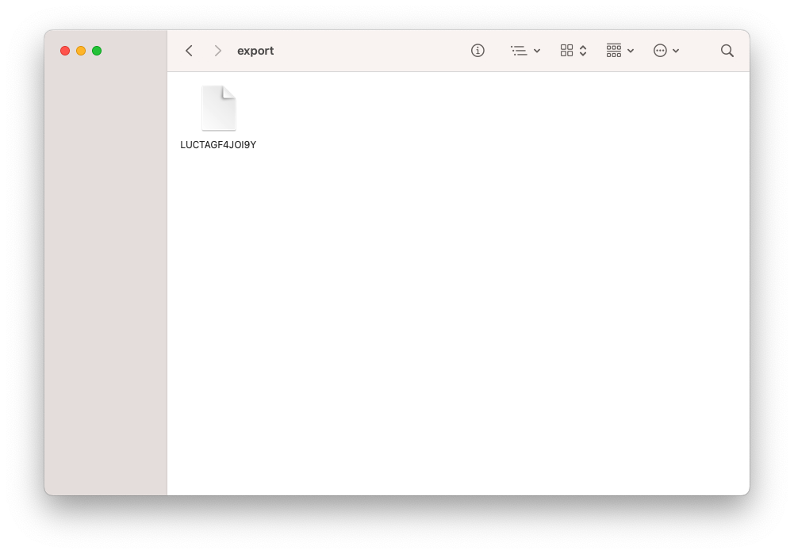

# Encrypt File

python 3.11以上
#### 使用的庫:
* wxpython
* gnupg
* sqlite3

### 使用步驟

先將要加密的檔案放到**data/files**資料夾內。

python 執行 **Manager.py** 檔，並選擇要加密的檔案按下**encrypt**。

**data/export**資料夾內會出現加密後的檔案。

對已加密的檔案按下 **decrypt** ，軟體會檢驗**data/export**內使否有相對應的加密檔案，有的話即解密檔案到**data/export**。

